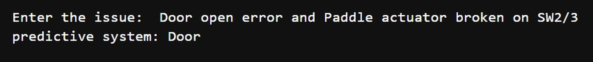
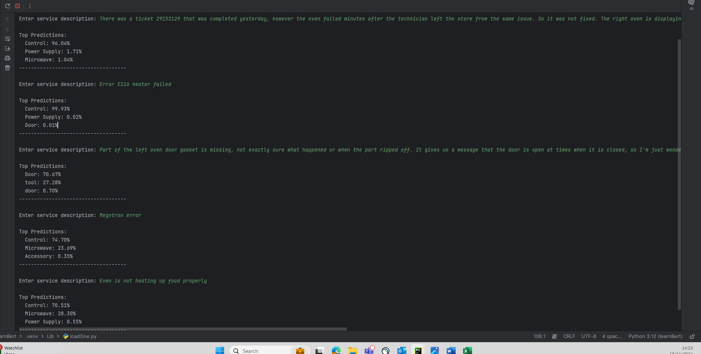
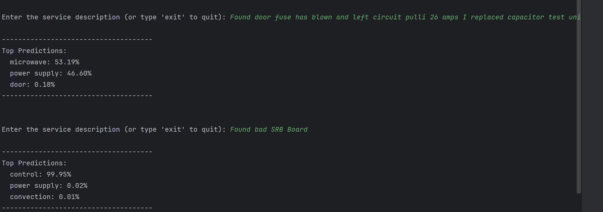
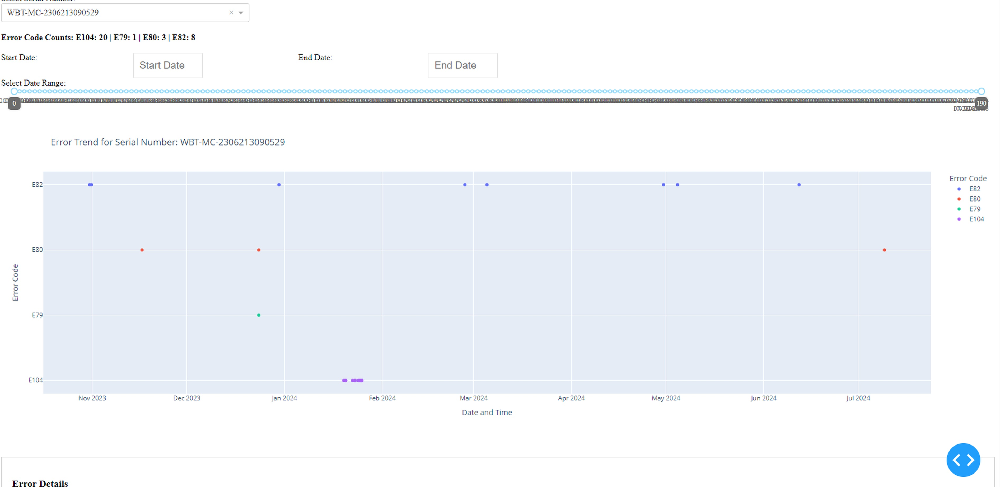
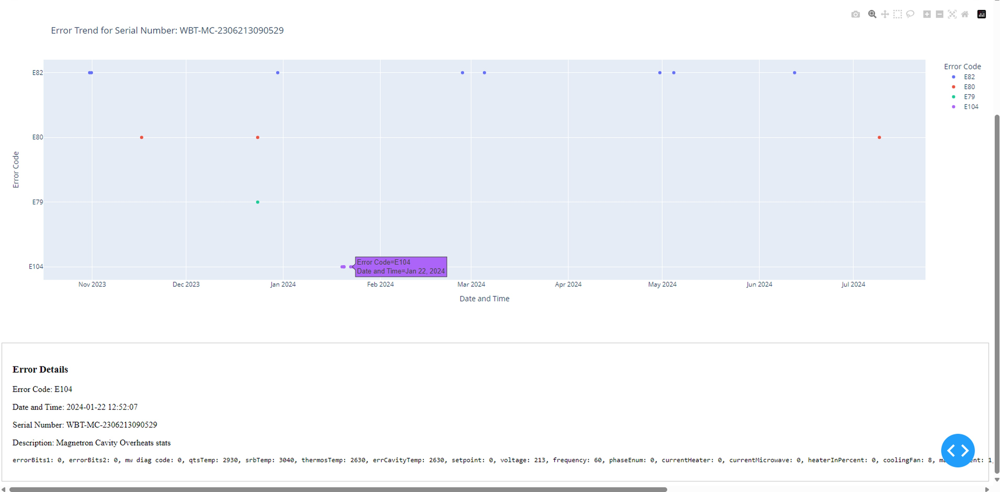

## Service Data Analytics

## Contents
1. [Project Genesis](#project-genesis)
    - [Initial Problem](#initial-problem)
    - [Objective](#objective)
    - [Data Sources](#data-sources)
2. [Work Accomplished to Date](#work-accomplished-to-date)
    - [Data Preparation and Keyword Extraction](#data-preparation-and-keyword-extraction)
    - [Correlation Analysis](#correlation-analysis)
3. [Challenges and Strengths](#challenges-and-strengths)
    - [Strengths](#strengths)
    - [Challenges](#challenges)
4. [Future Scope](#future-scope)
    - [Chatbot/Dashboard Concept](#chatbotdashboard-concept)
    - [Basic Q&A Implementation](#basic-qa-implementation)
5. [Conclusion](#conclusion)

## Project Genesis

### Initial Problem
This project was initiated to address the complexities involved in handling and analyzing service data. The goal was to identify patterns in recurring issues and streamline the process, thereby addressing inefficiencies in diagnosing service-related problems.

### Objective
The primary objective of this project is to leverage data analytics, particularly through keyword analysis in service summaries, to enhance diagnostic efficiency. By analyzing service data, we aim to extract insights that can highlight recurring issues and areas for improvement.

### Data Sources
We began with internal resources, including CPS and Tesseract service reports. Recognizing the effectiveness of these data sources, we expanded our dataset to include external data: service manuals and error code documents from the Merrychef portal, which served as additional knowledge bases. These sources collectively formed a comprehensive dataset for analysis. Moving forward, we are planning to incorporate Starbucks portal data for betterment.

## Work Accomplished to Date
Our team has made significant progress, laying the groundwork for a data-driven service solution through several key steps:

### Data Preparation and Keyword Extraction

#### Keyword Extraction 
We started by extracting keywords from service reports to pinpoint common issues and patterns that frequently require replacement. This process involved identifying terms that consistently appeared across multiple reports, helping us understand recurring problem areas.

#### Sample: Keywords associated with door system

#### Categorizing system:
By associating keywords with specific part swaps, we created a structured system list that clarifies each issue type, such as categorizing problems as “Microwave” or “Controller” and many more, based on the nature and system associated with service calls. This classification now allows for quicker diagnosis of issue types and assists in creating a targeted troubleshooting area.

### Correlation Analysis

#### Keyword and System Associated Correlation:
We utilized advanced models within Large Language Models (LLMs) to analyze and establish relationships between keywords and their associated systems. This analysis has provided us with predictive insights into likely failure points, enabling a more proactive approach to part replacement and maintenance.

#### Sample: Describe the issue, and it predicts the defective system

**The systems list includes:**
- Control, Power Supply, Microwave, Convection, Door, Cooling, Cavity, Accessory, Casework

**Case 1:** In a hypothetical training approach, the model was trained such that each claim corresponds to a single part swap and service description. Under this setup, the model achieves a success rate of **85-90%**.

**Case 2:** In another hypothetical approach, the model was trained on complete data that mirrors the original structure, where single claims involve multiple systems or part swaps associated with a single service description. Using this training approach with the current model (*DistilBERT*), the success rate of **65-74%**.

We are actively working on improving accuracy by implementing feature enhancements and equipping the model with baseline scenarios to enable more precise predictions and trying to achieve **80-90% accuracy**.

The snapshot of results:

#### Keywords and Part Failure:
We are further examining how keywords correlate with part failure in predictive systems. By understanding these connections, we can gain valuable insights that are essential for preventive maintenance and improved troubleshooting accuracy.

#### Error Correlations:
We are also analyzing correlations between different error codes to identify if any patterns emerge.

#### Snapshots of results:

## Challenges and Strengths

### Strengths

#### Pattern Identification in Part Replacements:
- The project effectively identifies recurring patterns in part replacements, enabling more accurate predictions of inventory requirements and insights into part life spans.
- By categorizing keywords associated with specific issues and part replacements, we can enhance diagnostic processes and create targeted predictions for troubleshooting specific areas.

#### Predictive Insights Through Correlation Analysis:
- Leveraging advanced models and correlation analysis, we are able to generate predictive insights into likely failure points, supporting proactive maintenance efforts.

### Challenges

#### Data Quality and Structure:
- A major challenge is the unstructured nature of the current service data. Service summaries often lack critical details, such as the reasons for part replacements, specific error codes, and the steps taken to resolve issues.
- This absence of structured information limits our ability to understand the root causes of recurring issues fully.

#### Gaps in Error Analysis Knowledge:
- Although we have data on part replacements and patterns, the current dataset lacks comprehensive information on error causes, resulting in incomplete error analysis.
- To address this gap, we plan to integrate data from the Starbucks portal, which includes a more detailed set of error codes and diagnostic information.

## Future Scope

### Chatbot/Dashboard Concept
Based on our initial findings, we have identified an opportunity to develop a **chatbot** or **dashboard** that would serve as an interactive assistant. This tool could address basic queries and offer guided solutions. By incorporating predictive models, the system could eventually provide real-time diagnostics and suggest appropriate fixes. As it learns from new service data, its capabilities would continue to improve, making it more accurate and reliable over time.

### Basic Q&A Implementation
To handle frequently asked questions, assisting in fundamental troubleshooting through insights derived from our knowledge base.

## Conclusion

This data analysis project has laid a strong foundation for developing a **smart, data-driven service analysis system**. By aggregating a robust knowledge base from external data, extracting relevant keywords from service reports, and analyzing correlations, we are building a comprehensive framework. With ongoing model training and correlation analysis, our ultimate goal is to diagnose and identify patterns in service issues. After evaluating the quality of the current data, we also plan to incorporate Starbucks data to further enhance the results and insights. This analysis will contribute to creating an expert system that could transform service operations into a smarter, more efficient system.
