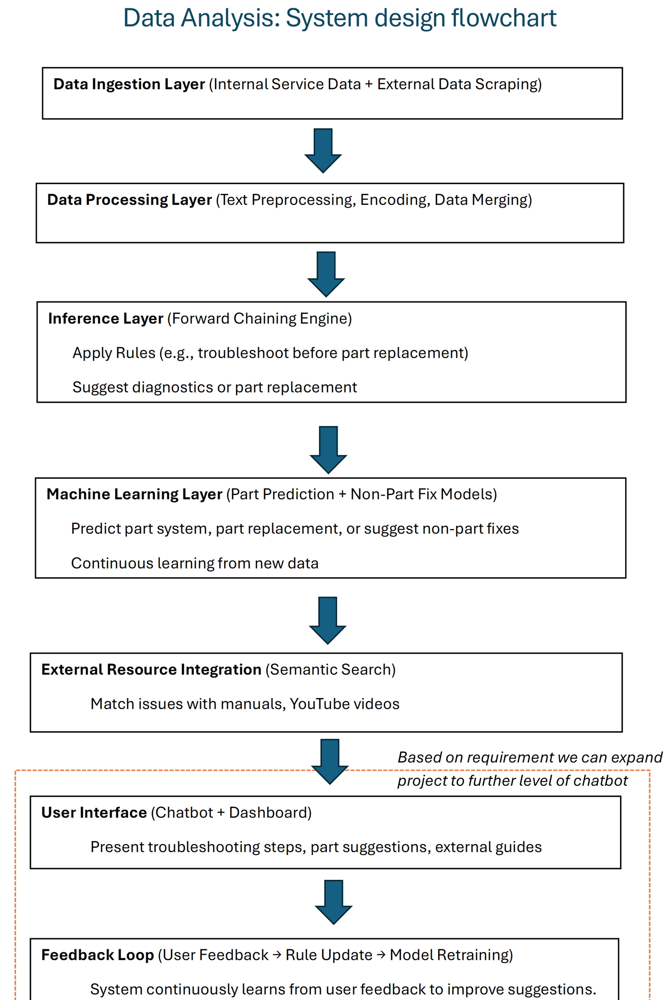
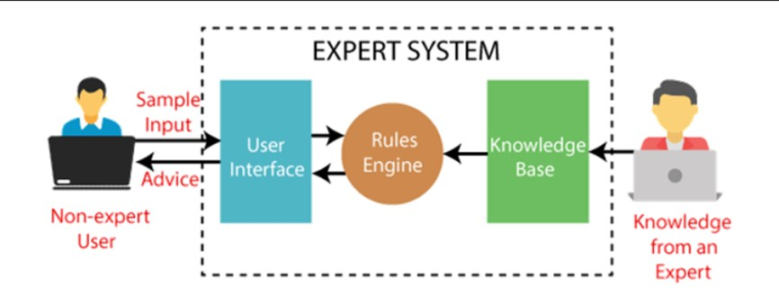

# **Data Analysis: System Design Flowchart**

# **Flow System Design Architecture**

## **1. Data Ingestion Layer (Internal Service Data + External Data Scraping)**

### **Service Data (Internal)**
- **Source**: Internal databases, service logs, or CSV files.
- **Description**: Includes structured data like part replacements and service descriptions.
- **Update Frequency**: Continuous, Per day/month (new service entries, logs).

### **External Data (Web & YouTube Scraping)**
- **Source**: Merrychef's official portal (manuals, FAQs) and YouTube videos (tutorials, repair guides).
- **Description**: Scraped data from manuals, video transcripts, blogs, and FAQs related to troubleshooting and part replacements.
- **Update Frequency**: Scheduled scraping (e.g., weekly, or real-time API pull for new videos or content).

---

## **2. Data Processing and Preprocessing Layer**
### **Text Preprocessing**
- **Internal Data**: Tokenize, clean, and convert service descriptions (`FSR_Solution`, `Rep_Desc`) into feature vectors using TF-IDF or word embeddings.
- **External Data**: Process scraped text from manuals and YouTube video transcripts to extract relevant entities (e.g., part names, troubleshooting steps) using Named Entity Recognition (NER).

### **Categorical Encoding**
- Encode structured data such as part numbers, part systems, and other categorical fields using **Label Encoding** or **One-Hot Encoding**.

### **Combining Data**
- Merge internal service data with external resources based on keywords, issues, or parts mentioned to enrich the knowledge base.

---

## **3. Inference and Reasoning Layer (Forward Chaining)**
### **Forward Chaining Inference Engine**
- A rule-based reasoning engine applies predefined rules to service descriptions to infer part systems, troubleshooting steps, or part replacements.

### **Rules for Issue Resolution Without Part Swap**
- Suggests diagnostics, maintenance, or other non-invasive solutions (e.g., recalibrating sensors, cleaning air filters).
- **Example**: IF *"temperature instability"* is mentioned, THEN suggest recalibrating the temperature sensor instead of immediately recommending a part swap.

### **Dynamic Rule Update**
- As new service issues and solutions arise, the system learns and dynamically updates rules.

---

## **4. Machine Learning Layer (Continuous Learning)**
### **Part System Prediction Model**
- A classification model (e.g., **Random Forest**, **XGBoost**) predicts the likely part system (**Thermal, Electrical, etc.**) based on service descriptions.

### **Part Replacement Prediction Model**
- A second classifier predicts the specific part replacement within the identified part system.

### **Root Cause and Non-Part Fix Model**
- Train models to recognize recurring issues that can be resolved without part replacement (e.g., operational issues, environmental conditions).

### **Continuous Learning and Retraining**
- **Incremental Learning**: Models update as new service data is logged.
- **Model Retraining Pipeline**: Automatically retrains models periodically (e.g., weekly) using **Airflow** or **Prefect**.

---

## **5. External Resource Integration Layer (Manuals and Videos)**

### **Semantic Search Engine**
- Uses **BERT embeddings** or **sentence similarity** to match service descriptions with relevant external resources (manuals, YouTube tutorials, troubleshooting guides).

### **Recommendation Engine**
- Based on the issue described, the system recommends relevant resources (e.g., suggest a video on recalibration if temperature issues are detected).

---

## **6. User Interface Layer**
### **Chatbot Interface**
- A chatbot (using **Rasa** or **Dialogflow**) allows users (e.g., service engineers) to input service issues in natural language.
- The chatbot provides troubleshooting steps, part replacement suggestions, or links to external guides (manuals, videos).

### **Dashboard Interface**
A web-based dashboard (using **Streamlit, Flask**) displays:
- Service data insights and trends.
- Part replacement recommendations and non-invasive fixes.
- Suggested external resources (videos, manuals).
- Feedback collection for continuous learning.

---

## **7. Feedback Loop for Continuous Improvement**
### **User Feedback Collection**
- After each recommendation (part replacement or troubleshooting step), users provide feedback on whether the suggestion worked.

### **Feedback-Driven Rule Update**
- If a non-part swap fix (e.g., recalibration) successfully resolves an issue, the system updates its rules to prioritize that fix in future cases.

### **Model Refinement**
- Feedback is used to refine machine learning models, updating the system's understanding of when part replacements are necessary and when a fix can resolve the issue.

---

## **Future Expansion: Chatbot**
- Based on requirements, the project can expand to a more advanced chatbot for automated troubleshooting.
